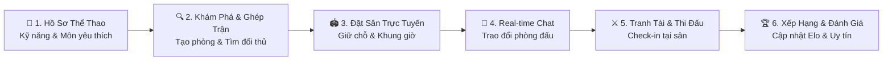

<div align="center">

# 🏅 SportMate
### *Hệ Sinh Thái Kết Nối Thể Thao & Đặt Sân Trực Tuyến Tích Hợp Ghép Trận Thông Minh*

<p align="center">
  <a href="https://github.com/ekancisme/sportmate">
    
  </a>
</p>

[](https://opensource.org/licenses/MIT)
[](https://reactnative.dev/)
[](https://expo.dev/)
[](https://www.typescriptlang.org/)
[](https://nodejs.org/)
[](https://www.mongodb.com/)
[](https://socket.io/)

<p align="center">
  
</p>

</div>

## 🌟 Giới Thiệu Tổng Quan (Introduction)

**SportMate** là ứng dụng di động toàn diện kết hợp giải pháp máy chủ hiện đại, giải quyết triệt để bài toán **"Thiếu người chơi - Khó tìm sân - Kết nối cộng đồng thể thao rời rạc"**.

Được thiết kế dựa trên triết lý **"Tìm Bạn Chuẩn Trình ➔ Giữ Chỗ Liền Tay ➔ Kết Nối Tức Thì ➔ Thăng Hạng Phong Độ"**, SportMate mang lại trải nghiệm liền mạch từ bước cá nhân hóa hồ sơ thể thao, tự động ghép trận theo kỹ năng, đặt lịch sân bãi theo thời gian thực cho đến việc xây dựng cộng đồng thể thao văn minh, năng động.

---

## 🚀 Luồng Trải Nghiệm Thể Thao Thông Minh (The SportMate Flow)



### ✨ Các Chặng Trải Nghiệm Nổi Bật:
1. **👤 Thiết Lập Hồ Sơ Vận Động Viên**: Khởi tạo thông tin cá nhân, định danh cấp độ thi đấu (Mới chơi, Phong trào, Bán chuyên, Chuyên nghiệp), vị trí sở trường và các môn thể thao quan tâm (Bóng đá, Cầu lông, Pickleball, Tennis, Bóng rổ...).
2. **🔍 Ghép Trận Thông Minh (Smart Matchmaking)**: Tạo trận đấu mới hoặc tham gia vào các phòng đấu có sẵn. Hệ thống tự động lọc theo bán kính khoảng cách, môn thể thao, thời gian diễn ra và trình độ tương đương.
3. **🏟️ Khám Phá Cụm Sân & Đặt Chỗ (Venue & Court Booking)**: Định vị GPS tìm các cụm sân thể thao gần nhất, trực quan hóa trạng thái khung giờ còn trống, đặt sân giữ chỗ nhanh chóng và chống xung đột lịch trùng.
4. **💬 Phòng Chat Thời Gian Thực (Socket.io Real-time Chat)**: Nhắn tin trực tiếp 1-1 giữa các vận động viên hoặc trò chuyện nhóm trong phòng trận đấu để thống nhất đội hình, chi phí và thời gian khởi tranh.
5. **🤖 Trợ Lý Thể Thao AI (AI Sport Assistant)**: Chatbot thông minh hỗ trợ giải đáp luật chơi, tư vấn bài tập khởi động, đề xuất trang bị phù hợp và hỗ trợ nhanh mọi thắc mắc trong ứng dụng.
6. **🏆 Bảng Xếp Hạng Phong Độ (Leaderboard & Sportsmanship)**: Hệ thống ghi nhận kết quả thi đấu, tính điểm phong độ, xếp hạng tuần/tháng và hệ thống đánh giá độ uy tín (Fair-play) của từng người chơi.

---

## 🎨 Điểm Nhấn Thiết Kế & Trải Nghiệm Người Dùng (UI/UX Highlights)

<div align="center">

| 📱 Giao Diện Đẳng Cấp | ⚡ Tốc Độ & Phản Hồi | 🛡️ Quản Trị Toàn Diện |
| :---: | :---: | :---: |
| Phối màu Energetic Emerald sang trọng, tối ưu Dark/Light Mode với Parallax Scroll | Phản hồi xúc giác (Haptic Touch), cập nhật Real-time Socket và đồng bộ Offline Cache | Cổng Admin Dashboard kiểm duyệt sân bãi, giải quyết khiếu nại và giám sát hệ thống |

</div>

- **Trải Nghiệm Đỉnh Cao Trên Thiết Bị Di Động**:
  - **Haptic Feedback**: Tương tác chạm rung nhạy bén khi bấm nút, xác nhận tham gia trận đấu hoặc hoàn tất đặt sân.
  - **Animated Navigation**: Điều hướng mượt mà với React Navigation v7 và Reanimated v4, thanh Tabs Bar phong cách hiện đại.
  - **Bản Đồ & Định Vị Tức Thì**: Tích hợp Location Services xác định khoảng cách chính xác đến từng sân đấu.

---

## 🛠️ Kiến Trúc Hệ Thống (System Architecture)

```
                       ┌─────────────────────────────────────┐
                       │          SportMate Mobile           │
                       │   React Native 0.81 + Expo 54 (TS)  │
                       └──────────────────┬──────────────────┘
                                          │ REST API / WebSocket
                       ┌──────────────────▼──────────────────┐
                       │          SportMate Server           │
                       │     Node.js + Express + MongoDB     │
                       └──────┬───────────────────────┬──────┘
                              │                       │
               ┌──────────────▼──────┐         ┌──────▼──────────────┐
               │    Socket.io Hub    │         │  AI Assistant Core  │
               │ Real-Time Messaging │         │ Smart Sport Chatbot │
               └─────────────────────┘         └─────────────────────┘
```

### 💻 Ứng Dụng Di Động (Client):
- **Core Framework**: React Native 0.81.5, React 19, Expo SDK 54, TypeScript 5.9
- **Routing & Navigation**: Expo Router v6 (File-based routing), React Navigation v7
- **UI Components & Icons**: Expo Vector Icons, Parallax Scroll View, Themed Components
- **Media & Device**: Expo Image Picker, Expo Haptics, Expo Location, Expo System UI
- **Networking & Cache**: Socket.io Client, AsyncStorage, IndexedDB Bridge

### ⚙️ Máy Chủ Dịch Vụ (Backend & Database):
- **Core Engine**: Node.js v20, Express
- **Cơ Sở Dữ Liệu**: MongoDB & Mongoose ODM (Schemas: User, Venue, Court, CourtBooking, Match, Message, Report)
- **Bảo Mật & Xác Thực**: JWT (JSON Web Token), Bcrypt Hashing, Password Reset Tokens
- **Thời Gian Thực (Real-time)**: Socket.io Server (Chat rooms, match notifications)
- **Xử Lý Tệp**: Multer Storage cho avatar và ảnh sân thể thao

---

## 👥 Phân Quyền & Vai Trò (User Roles & Access Control)

- 🏃 **Vận Động Viên (Athlete / Player)**: Tạo và tham gia phòng ghép trận, tìm sân, đặt lịch thi đấu, trò chuyện real-time và tích lũy điểm xếp hạng.
- 🏟️ **Chủ Sân / Đối Tác (Court Owner / Partner)**: Đăng ký cụm sân (Venues), quản lý danh sách sân con (Courts), cấu hình bảng giá giờ vàng và theo dõi lịch đặt sân của khách.
- 🛡️ **Quản Trị Viên (System Administrator)**: Truy cập cổng quản trị `/admin`, phê duyệt cụm sân mới, xử lý báo cáo vi phạm (`reports`), quản lý thành viên và điều phối hệ thống.

---

## 🌿 Quy Chuẩn Phân Nhánh (Branching Conventions)

Dự án áp dụng quy chuẩn phân nhánh chuẩn mực (Git Flow & Feature Branching):

| Nhánh | Mục Đích & Phạm Vi |
| :--- | :--- |
| `main` | **Production Ready** — Nhánh chính thức, mã nguồn ổn định nhất đã qua kiểm thử |
| `develop` | **Development Hub** — Nhánh tích hợp các tính năng chuẩn bị cho bản phát hành mới |
| `feature/auth` | Phân hệ xác thực, đăng ký, đăng nhập, quên mật khẩu và lưu trạng thái đăng nhập |
| `feature/user-profile` | Phân hệ hồ sơ vận động viên, chỉnh sửa thông tin cá nhân và kỹ năng |
| `feature/match-management` | Phân hệ quản lý trận đấu, tạo trận, danh sách trận đấu sắp diễn ra |
| `feature/match-finding` | Phân hệ ghép đối thủ, thuật toán lọc tìm bạn chơi thể thao |
| `feature/admin-dashboard` | Phân hệ trang tổng quan quản trị hệ thống và kiểm duyệt |
| `feature/admin-reports` | Phân hệ xử lý báo cáo vi phạm, tố cáo người chơi xấu hoặc sai sân |

---

## 🚀 Hướng Dẫn Cài Đặt & Chạy Ứng Dụng (Getting Started)

### 1. Yêu Cầu Tiên Quyết (Prerequisites)
- **Node.js**: $\ge$ v18 (Khuyến nghị Node.js v20 LTS)
- **Trình Quản Lý Gói**: `npm` hoặc `bun`
- **Cơ Sở Dữ Liệu**: MongoDB local hoặc MongoDB Atlas URI
- **Thiết Bị Kiểm Thử**: Ứng dụng **Expo Go** (trên iOS/Android) hoặc Android Studio / Xcode Simulator

### 2. Cấu Hình & Khởi Động Máy Chủ (Backend Server)
```bash
# Di chuyển vào thư mục server
cd server

# Cài đặt dependencies
npm install

# Tạo file cấu hình môi trường .env từ mẫu
cp .env.example .env

# Chỉnh sửa chuỗi kết nối MONGO_URI và PORT trong file .env
# Khởi động máy chủ phát triển
npm run dev # hoặc node index.js
```

### 3. Cài Đặt & Khởi Chạy Ứng Dụng Di Động (Mobile App)
```bash
# Tại thư mục gốc của dự án
npm install

# Khởi động Expo Development Server
npx expo start
```
- **Chạy trên điện thoại**: Quét mã QR hiển thị trên Terminal bằng camera (iOS) hoặc ứng dụng Expo Go (Android).
- **Chạy Web Preview**: Nhấn phím `w` trên bàn phím.
- **Chạy Android Emulator**: Nhấn phím `a`.
- **Chạy iOS Simulator**: Nhấn phím `i`.

---

<div align="center">

<p align="center">
  
</p>

**SportMate © 2026** — *Connecting Athletes, Elevating Sports Passion.*

Crafted with dedication by **ekancisme**

</div>
